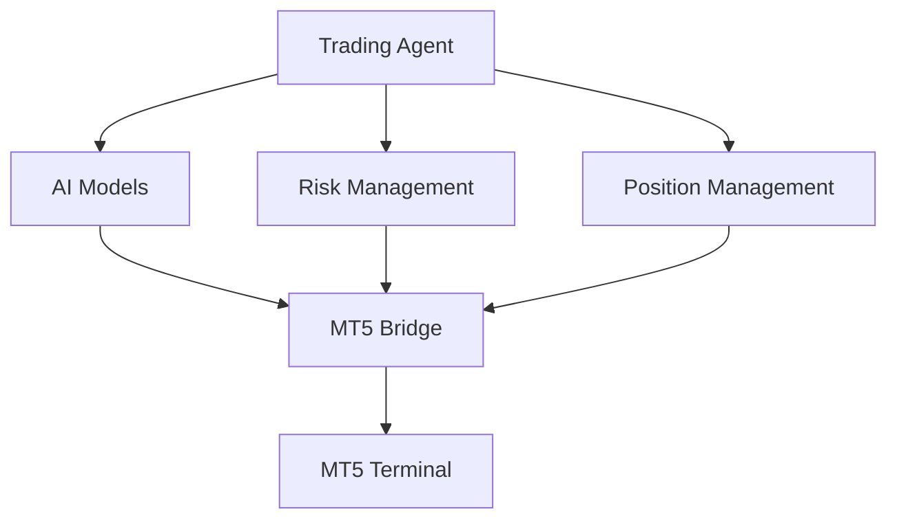

# Trading Agent MT5

## Spis treści
- [Cel projektu](#cel-projektu)
- [Założenia główne](#założenia-główne)
- [Funkcjonalności](#funkcjonalności)
- [Specyfikacja techniczna](#specyfikacja-techniczna)
- [Zasada działania](#zasada-działania)
- [Oczekiwane rezultaty](#oczekiwane-rezultaty)
- [Ograniczenia](#ograniczenia)
- [Rozwój projektu](#rozwój-projektu)
- [Kontakt i wsparcie](#kontakt-i-wsparcie)
- [Licencja](#licencja)

## Cel projektu
System automatycznego handlu wykorzystujący sztuczną inteligencję do analizy rynku i podejmowania decyzji tradingowych. Agent integruje zaawansowane modele AI (Claude, Grok, DeepSeek) z platformą MetaTrader 5, zapewniając autonomiczne zarządzanie pozycjami przy zachowaniu ścisłej kontroli ryzyka.

## Założenia główne

### 1. Architektura systemu


### 2. Komponenty AI
- **Claude (Anthropic)**: Analiza fundamentalna i makroekonomiczna
- **Grok**: Analiza wydarzeń rynkowych i sentymentu
- **DeepSeek**: Szybka analiza techniczna i walidacja setupów

### 3. Zarządzanie ryzykiem
- Maksymalna strata dzienna: 2% kapitału
- Stop-loss dla każdej pozycji
- Dynamiczne zarządzanie wielkością pozycji
- Monitoring ekspozycji na ryzyko

### 4. Strategia handlowa
- Podejście multi-timeframe
- Koncentracja na głównych parach walutowych
- Handel w godzinach najwyższej płynności
- Minimum 3 potwierdzenia przed otwarciem pozycji

## Funkcjonalności

### 1. Analiza rynku
- Automatyczna analiza technicznych setupów
- Ocena fundamentalnych czynników
- Monitorowanie ważnych wydarzeń ekonomicznych
- Analiza korelacji między instrumentami

### 2. Zarządzanie pozycjami
- Automatyczne otwieranie/zamykanie pozycji
- Trailing stop-loss
- Partial close
- Break-even management

### 3. Monitoring i raportowanie
- Real-time monitoring pozycji
- Analiza wydajności
- System alertów
- Raporty dzienne/tygodniowe

## Specyfikacja techniczna

### 1. Wymagania systemowe
- Python 3.10+
- PostgreSQL 15+
- MetaTrader 5
- Min. 16GB RAM
- Stabilne połączenie internetowe

### 2. Integracje
- MT5 Expert Advisor
- API modeli AI
- System bazodanowy
- System monitoringu

## Zasada działania

### 1. Flow decyzyjny
```python
def decision_flow():
    """
    1. Pobieranie danych rynkowych
    2. Analiza techniczna (DeepSeek)
    3. Walidacja fundamentalna (Claude)
    4. Analiza wydarzeń (Grok)
    5. Decyzja o wejściu/wyjściu
    6. Zarządzanie ryzykiem
    7. Wykonanie zlecenia
    8. Monitoring i adjustacja
    """
```

### 2. Proces analizy

#### Wstępna analiza
- Skanowanie rynku
- Identyfikacja potencjalnych setupów
- Walidacja technicznych warunków

#### Pogłębiona analiza
- Ocena fundamentalna
- Analiza sentymentu
- Weryfikacja setupu

#### Wykonanie
- Kalkulacja wielkości pozycji
- Określenie poziomów SL/TP
- Realizacja zlecenia

### 3. System zabezpieczeń
- Monitoring połączenia
- Walidacja wszystkich operacji
- System recovery
- Procedury kopii zapasowych

## Oczekiwane rezultaty

### 1. Wydajność
- Positive expectancy
- Drawdown < 10%
- Win rate > 55%
- Risk/Reward > 1.5

### 2. Operacyjne
- Availability > 99%
- Latency < 500ms
- Error rate < 1%
- Real-time monitoring

### 3. Biznesowe
- Stabilne wyniki
- Skalowalność systemu
- Minimalne koszty operacyjne
- Pełna automatyzacja

## Ograniczenia

### 1. Techniczne
- Zależność od dostępności API
- Limity wykonania MT5
- Wymagania sprzętowe
- Stabilność połączenia

### 2. Operacyjne
- Godziny handlu
- Limity brokerskie
- Koszty transakcyjne
- Dostępność płynności

## Rozwój projektu

### 1. Fazy rozwoju
- **MVP**: Podstawowa funkcjonalność
- **Beta**: Pełna integracja AI
- **Production**: System zabezpieczeń
- **Optimization**: Fine-tuning

### 2. Przyszłe rozszerzenia
- Dodatkowe instrumenty
- Nowe strategie
- Zaawansowana optymalizacja
- Funkcje Machine Learning

## Kontakt i wsparcie

### Twórcy
- [Imię Nazwisko] - Lead Developer
- [Imię Nazwisko] - AI Specialist
- [Imię Nazwisko] - Trading Specialist

### Wsparcie
- Email: support@tradingagent.com
- Documentation: [link]
- Issue Tracker: [link]

## Licencja
[Typ licencji]

---

*Uwaga: Jest to dynamiczny dokument, który będzie aktualizowany w miarę rozwoju projektu.*